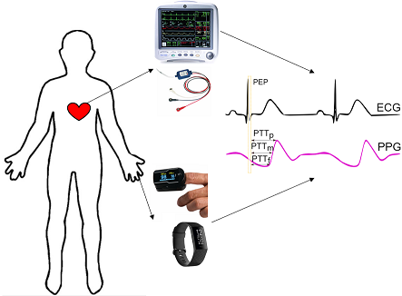
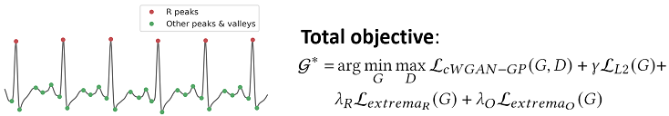
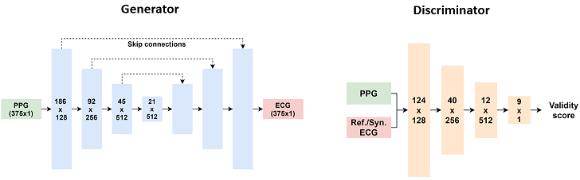

# Codebase for "P2E-WGAN: ECG Waveform Synthesis from PPG with Conditional Wasserstein Generative Adversarial Networks"

Paper link: https://dl.acm.org/doi/10.1145/3412841.3441979



## Model

#### ECG feature-based WGAN-GP loss function:



#### End-to-end 1D convolutional network architectures:



## Setup

To install the dependencies, you can run in your terminal:
```sh
pip install -r requirements.txt
```

A sampled dataset with ECG feature indices can be downloaded at [\[link\]](https://drive.google.com/file/d/1lLTerHpAx0w3Xg2QxZCuI6wAxpuC0TCH/view?usp=sharing).

## Usage

The code is structured as follows:
- `data.py` contains functions to transform and feed the data to the model;
- `models.py` defines deep neural network architectures; 
- `utils.py` has utilities to benchmark the model and calculate the gradient penalty;
- `p2e_wgan_gp.py` is the main entry to run the training and evaluation process (support running on multiple GPUs);
    - `--dataset_prefix` flag sets the directory containing the .npy files 
    - `--peaks_only` flag sets the model to reconstruct precisely only the main features for data augmentation purposes

## Citation

If you find this code helpful in any way, please cite our paper:

    @inproceedings{vo2021p2e,
        title={P2E-WGAN: ECG waveform synthesis from PPG with conditional wasserstein generative adversarial networks},
        author={Vo, Khuong and Naeini, Emad Kasaeyan and Naderi, Amir and Jilani, Daniel and Rahmani, Amir M and Dutt, Nikil and Cao, Hung},
        booktitle={Proceedings of the 36th Annual ACM Symposium on Applied Computing},
        pages={1030--1036},
        year={2021}
    }

## Acknowledgments

The implementation of the WGAN-GP model is based on this repository: https://github.com/eriklindernoren/PyTorch-GAN
